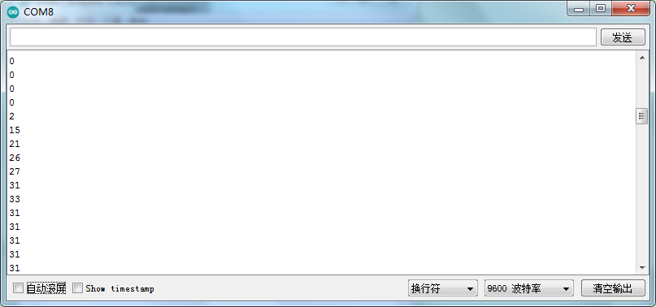

# Arduino


## 1. Arduino简介  

Arduino是一款开源电子原型平台，以其简易的编程环境和灵活的硬件结构而受到广泛欢迎。Arduino的核心是基于ATmega微控制器的开发板，能够通过编程与各种传感器、执行器和其他组件进行互动。用户可以使用Arduino编写代码来控制灯光、马达和其他电子设备，既适合初学者快速入门，又便于高级用户进行复杂项目的开发与实现。Arduino平台的丰富社区和大量的学习资源，使得其成为电子和编程教育中不可或缺的工具。  

## 2. 接线图  

  

## 3. 示例代码  

```cpp  
int sensorPin = A0; // 定义模拟口A0  
int value = 0; // 设置value为0  

void setup() {  
    Serial.begin(9600); // 设置波特率  
}  

void loop() {  
    value = analogRead(sensorPin); // 将value设置为读取到的A0的数值  
    Serial.println(value, DEC); // 显示value数值，并自动换行  
    delay(100); // 延迟0.1S  
}  
```  

## 4. 实验结果  

线路连接好后，上传程序代码，然后打开串行监视器，设置波特率为9600，它将显示数据，如下图所示。  




