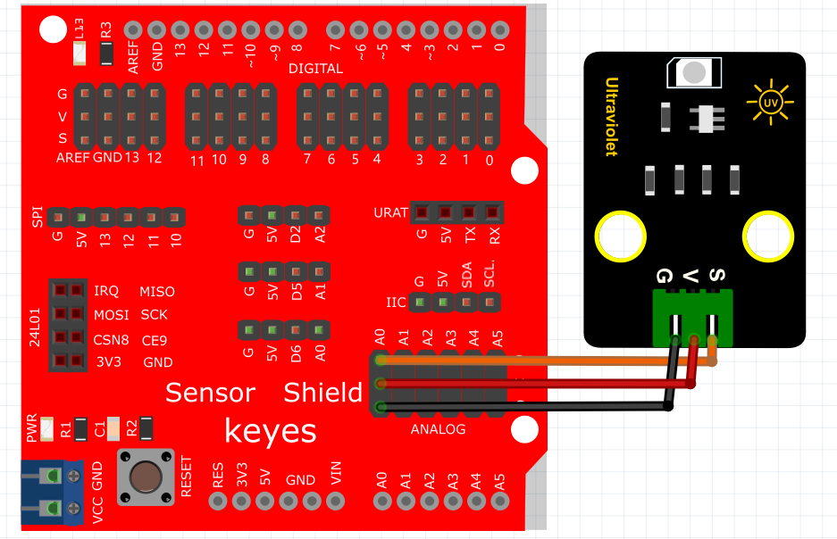
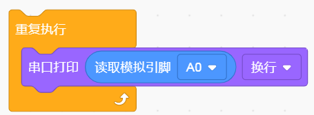
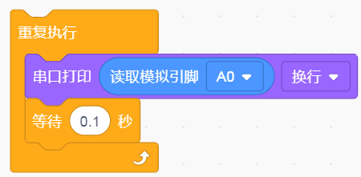
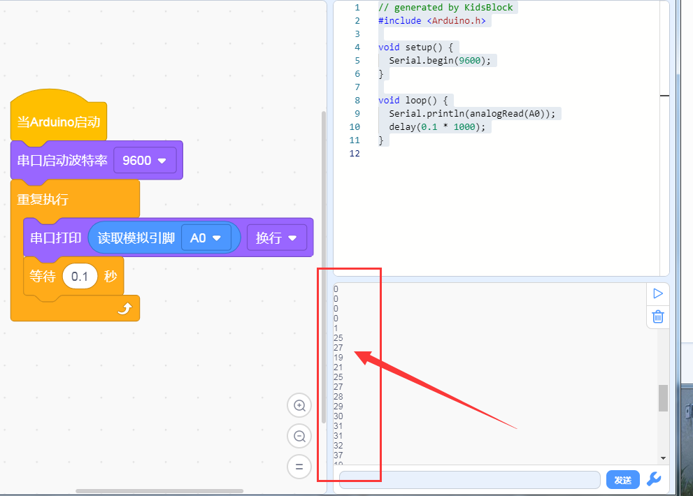

# KidsBlock

## 1. KidsBlock简介  

KidsBlock是一款直观的图形化编程工具，旨在帮助儿童和初学者通过拖放式界面学习编程概念。它提供不同的模块，用户可以通过简单的图形块组合来构建程序，而不必编写复杂的代码。KidsBlock特别适合与Arduino等硬件平台配合使用，用户可以轻松创建各种项目，例如控制LED灯、传感器数据读取和电机控制等。该工具的易用性和互动性使得学习编程变得更加有趣，并激发了年轻学习者的创造力。  

## 2. 接线图  

  

## 3. 示例代码  

1. 在事件里拖出Arduino启动模块。  
   
     

2. 在串口栏拖出设置串口波特率模块并设置波特率为9600。  
   
     

3. 在控制栏拖出重复执行模块。  
   
     

4. 在串口栏拖出串口打印模块；在引脚栏拖出读取模拟引脚模块设置引脚为A0并添加到串口打印模块上。  
   
     

5. 在控制栏拖出延时模块并设置延时为100ms。  
   
     

## 4. 实验结果  

线路连接好后，上传程序代码，它将显示数据，如下图所示。  

