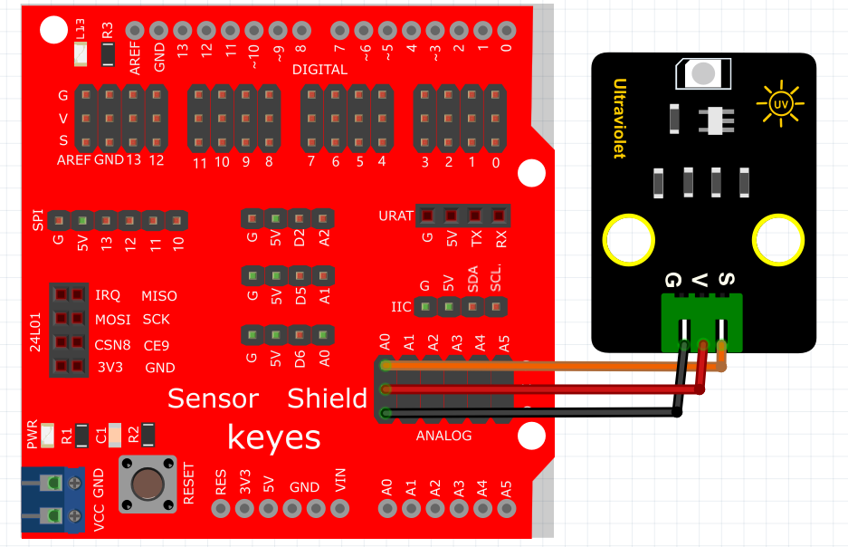

# Mixly

## 1. Mixly简介  

Mixly是一款图形化编程工具，旨在帮助初学者和儿童通过简单易懂的积木式编程学习基础编程知识。它采用直观的拖拽操作方式，用户可以通过将各种功能模块组合在一起来创建程序，而不需要掌握复杂的编程语法。Mixly支持与Arduino等硬件平台的连接，使用户能够轻松构建电子项目，如机器人、传感器应用等。该工具的互动性和丰富的项目资源，能够有效激发年轻学习者的创造力与兴趣，适合教育和自学使用。  

## 2. 接线图  

  

## 3. 示例代码  

  

## 4. 实验结果  

线路连接好后，上传程序代码，然后打开串行监视器，设置波特率为9600，它将显示数据，如下图所示。  

