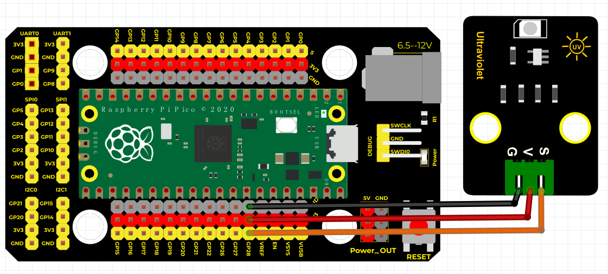
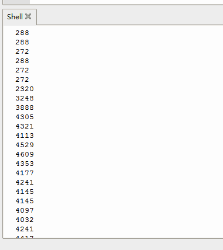

# Python


## 1. Python简介  

Python是一种高级编程语言，以其清晰的语法和强大的功能而闻名，广泛应用于数据科学、机器学习、Web开发、自动化脚本等多个领域。它拥有丰富的标准库与第三方库，使得程序员能够快速构建复杂的应用程序。Python适合初学者和专业开发者，提供了交互式编程环境以及通过简单的模块化编程来实现功能。通过使用丰富的框架和工具，Python在教育、科研和商业领域得到了广泛的应用，成为学习编程和构建应用程序的热门选择。  

## 2. 接线图  

  

## 3. 示例代码  

```python  
import machine  
import utime  

analogPin = machine.ADC(28)  # 设置28脚为模拟信号  

while True:  
    reading = analogPin.read_u16()  # 读取模拟信号  
    print(reading)  # 打印模拟值  
    utime.sleep_ms(100)  
```  

## 4. 实验结果  

线路连接好后，上传程序代码，它将显示数据，如下图所示。  




